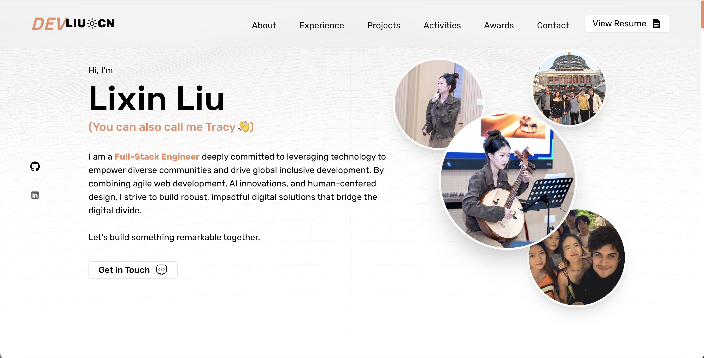

# **Lixin Liu (DevTracy) | Portfolio**



A **modern, responsive, and SEO-friendly portfolio** built with **Next.js 14, TypeScript, and Tailwind CSS**. It showcases my projects, technical skills, and experience as a Master's student in Electronic Information at Tsinghua University and my journey as a Full-Stack Engineer, Product Manager, and Open Source Contributor.

> **Acknowledgments**: This portfolio was built upon and heavily customized from the excellent open-source template [devfarouk](https://github.com/Farouk-ayo/devfarouk) by [Farouk Mustapha](https://github.com/Farouk-ayo). Respect and thanks to the original author for the foundation!

---

## 🚀 **Tech Stack**

**Frontend Framework:** [Next.js 14](https://nextjs.org/)
**Language:** [TypeScript](https://www.typescriptlang.org/)
**UI & Styling:** [Tailwind CSS](https://tailwindcss.com/) · [Shadcn/ui](https://ui.shadcn.com/) · [Framer Motion](https://www.framer.com/motion/) · [AOS (Animate on Scroll)](https://michalsnik.github.io/aos/)
**Icons:** [Lucide React](https://lucide.dev/) · [Radix UI](https://www.radix-ui.com/) · [React Icons](https://react-icons.github.io/react-icons/)
**Theme Management:** [Next Themes](https://github.com/pacocoursey/next-themes) (Dark/Light mode)

---

## ✨ **Features**

✅ **Fully Responsive** – Mobile-first and optimized for all screen sizes
✅ **Dark & Light Mode Support** – Seamless theme switching
✅ **SEO Optimized** – Metadata, Open Graph, and Twitter Card integration
✅ **Interactive UI** – Smooth animations & hover effects with Framer Motion and AOS
✅ **Project Showcases** – With live demo & GitHub repository links
✅ **Performance Optimized** – Next.js image optimization & lazy loading

---

## 🛠 **Getting Started**

### **1. Clone the Repository**

```bash
git clone https://github.com/liulx25xx/liulx25xx.github.io.git
cd liulx25xx.github.io
```

### **2. Install Dependencies**

```bash
npm install
```

### **3. Run the Development Server**

```bash
npm run dev
```

Then open **[http://localhost:3000](http://localhost:3000)** in your browser.

### **4. Build for Production (Static Export)**

```bash
npm run build
```
This will generate an `out` folder that can be directly deployed to GitHub Pages.

---

## 🔗 **Live Demo**

👉 **[liulx25xx.github.io](https://liulx25xx.github.io)**

---

## 📬 **Contact Me**

- **Portfolio**: [liulx25xx.github.io](https://liulx25xx.github.io)
- **GitHub**: [github.com/liulx25xx](https://github.com/liulx25xx)
- **Email**: [liulx25@mails.tsinghua.edu.cn](mailto:liulx25@mails.tsinghua.edu.cn)

---
